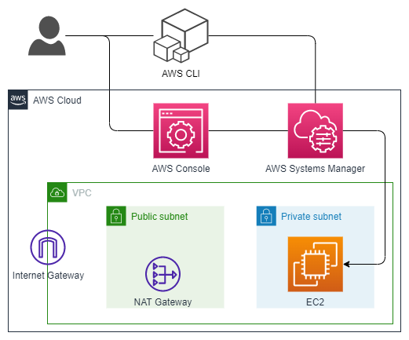
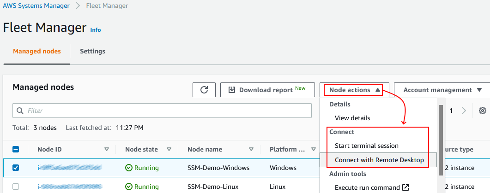

# SSM Session Manager Demo

[AWS Systems Manager Session Manager](https://docs.aws.amazon.com/systems-manager/latest/userguide/session-manager.html)

>Session Manager is a fully managed AWS Systems Manager capability. With Session Manager, you can manage your Amazon Elastic Compute Cloud (Amazon EC2) instances, edge devices, and on-premises servers and virtual machines (VMs). You can use either an interactive one-click browser-based shell or the AWS Command Line Interface (AWS CLI). Session Manager provides secure and auditable node management without the need to open inbound ports, maintain bastion hosts, or manage SSH keys.

[AWS Systems Manager Fleet Manager](https://docs.aws.amazon.com/systems-manager/latest/userguide/fleet.html)

>Fleet Manager, a capability of AWS Systems Manager, is a unified user interface (UI) experience that helps you remotely manage your nodes running on AWS or on premises. With Fleet Manager, you can view the health and performance status of your entire server fleet from one console. You can also gather data from individual nodes to perform common troubleshooting and management tasks from the console. This includes connecting to Windows instances using the Remote Desktop Protocol (RDP), viewing folder and file contents, Windows registry management, operating system user management, and more.

## Resources deployed by this manifest:

- Linux EC2 Instance.
- Windows 2019 EC2 Instance.
- SSH Security Group.
- RDP Security Group.
- EC2 Instance IAM Role to allow SSM operations.

### Deployment diagram:



## Tested with: 

| Environment | Application | Version  |
| ----------------- |-----------|---------|
| WSL2 Ubuntu 20.04 | Terraform | v1.1.8 |
| WSL2 Ubuntu 20.04 | Terraform | v2.5.3 |

## Initialization How-To:

Located in the root directory, make an "aws configure" to log into the aws account, and a "terraform init" to download the necessary modules and start the backend.

```bash
aws configure
terraform init
```
Generate a Key-Pair using the provided script:

```bash
bash scripts/create_ssh_key.sh
```

## Deployment How-To:

Located in the root directory, make the necessary changes in the variables.tf file and run the manifests:

```bash
terraform apply
```

## Testing the solution:

### Test locally using the provided script:

```bash
#Run the script passing the instance ID as a variable:
bash scripts/start-session.sh -i-abcdef0987654321
```

### Test from the AWS Console:

- Go to the AWS Console
- Open the AWS Systems Manager Console.
- Go to Node Management - Fleet Manager.

There you will find a list with all the instances that support Session Manager and from the "Node Actions" dropdown menu you can choose a connection method.



## Author:

- [@JManzur](https://jmanzur.com)

## Documentation:

- [Session Manager prerequisites](https://docs.aws.amazon.com/systems-manager/latest/userguide/session-manager-prerequisites.html)